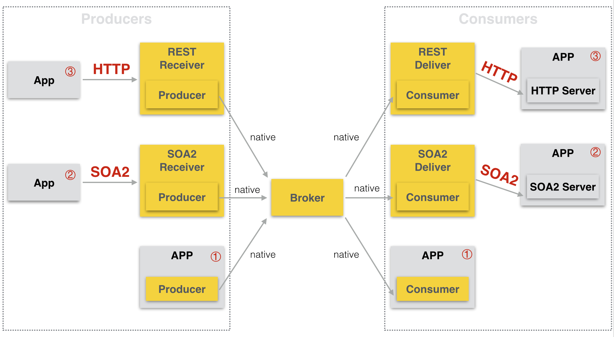

# Hermes via HTTP and SOA2 spec

## 整体架构

## HTTP请求格式
### 消息发送
用户将消息按Topic约定的方式进行序列化，然后将序列化后的消息内容作为POST请求的内容POST到相应的URL，需要将Content-Type设定为application/octet-stream。如果Topic使用的是JSON序列化方式，可以直接POST JSON字符串。

curl -XPOST -H"Content-Type:application/octet-stream" http://1.1.1.1/order_new -d '{"id" : 1}'

#### 可选的HTTP Header
Header名称 | 说明 | Header值类型 | 默认值
--------- |------|-------------|-----
X-Hermes-Ref-Key | 消息的ref key | 字符串(长度<100) | 无 
X-Hermes-Priority-Message | 消息是否优先处理 | true, false | false
X-Hermes-Message-Property | 消息属性 | key=value | 无

### 消息接收
用户需要在Hermes Portal上注册用于接收消息的HTTP URL。Hermes会将消息以HTTP POST请求的方式推送到这些URL。

POST请求的内容为按Topic约定的方式序列化后的消息内容，Content-Type为application/octet-stream。用户获取消息内容后进行反序列操作就可以对消息进行处理。

curl -XPOST -H"Content-Type:application/octet-stream" http://1.1.1.1/order_new -d '{"id" : 1}'

#### HTTP Header
Header名称 | 说明 | Header值类型
--------- |------|-------------|-----
X-Hermes-Topic | 消息所属的Topic | 字符串 
X-Hermes-Ref-Key | 消息的ref key
X-Hermes-Message-Property | 消息属性 | key=value

## SOA2请求格式
